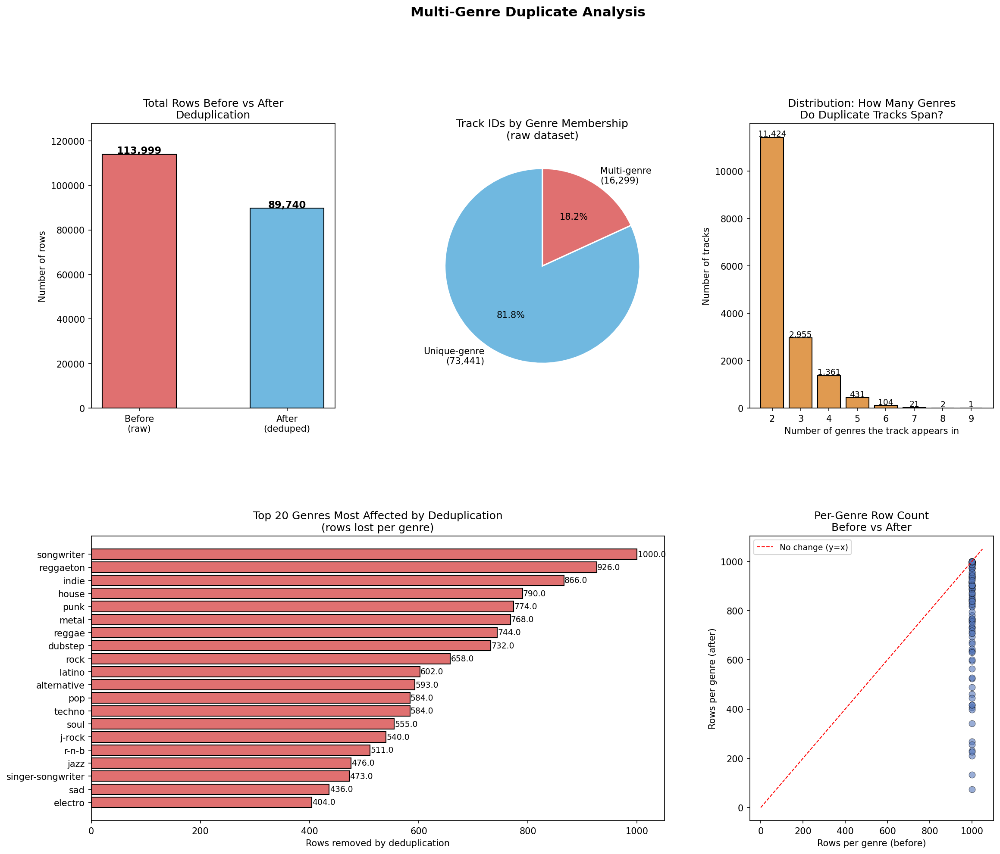
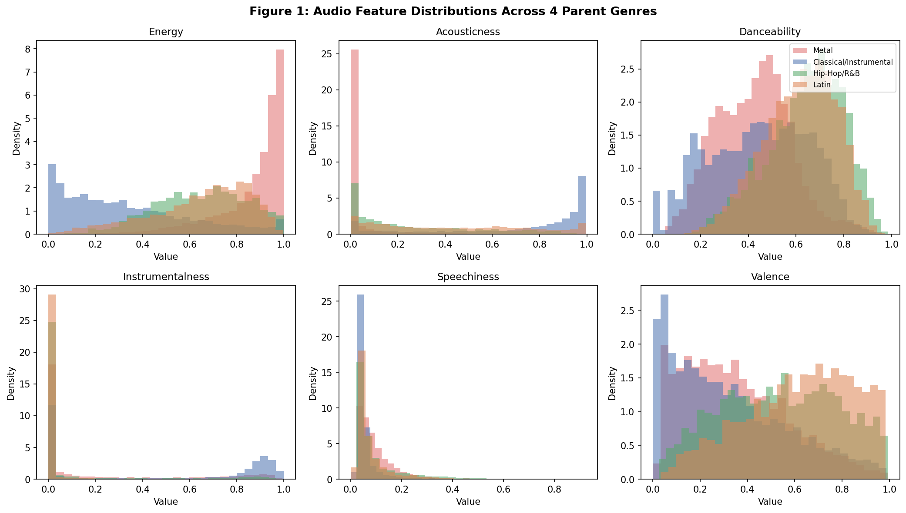
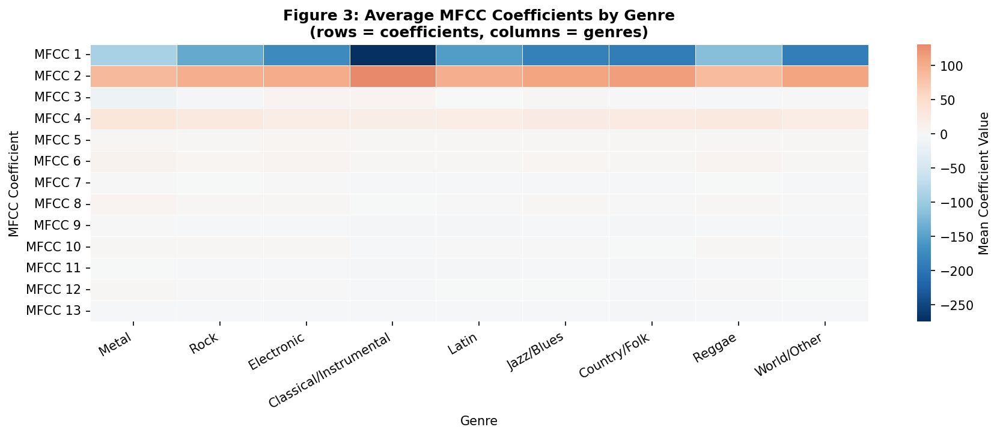
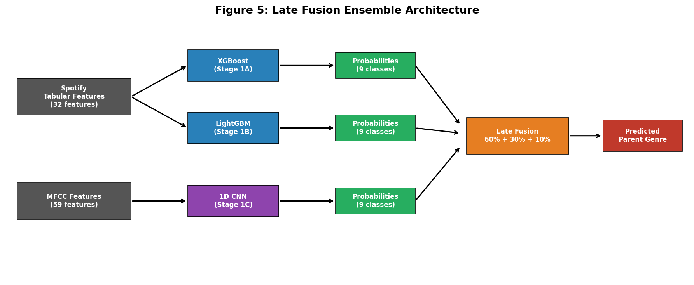
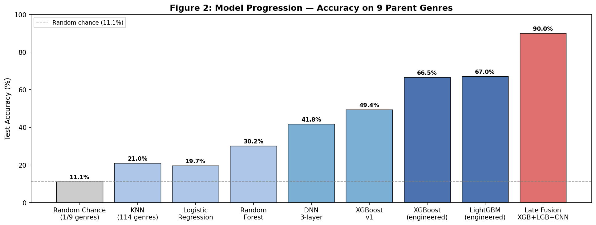
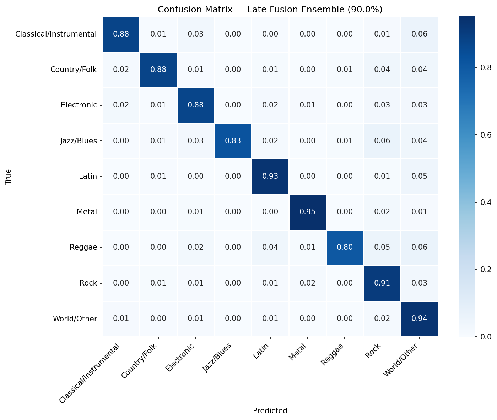

# Automatic Music Genre Classification
### Using Spotify Audio Features and MFCC-Based Late Fusion
**Authors:** Aymen Tiguite, Cindy Frempong
**Boston University | DS 340**
**April 27th 2026**

---

## Introduction

Music genre classification is a classic problem in audio and music information retrieval (MIR). Automatically identifying a song's genre has real-world applications across the music industry, from powering recommendation engines on streaming platforms like Spotify and Apple Music, to organizing large digital music libraries, to enabling content-based search and music discovery. Despite its practical importance, genre classification is a genuinely hard problem: genre boundaries are fuzzy, listener perceptions constantly vary, and many songs blend elements of multiple genres together at the same time.

In this paper, we explore multiple model types and ensemble methods to eventually train a convolutional neural network (CNN) to correctly identify the genre of a given song. We draw on a dataset of tracks described by a set of numerical audio descriptors that summarize musical properties, from Spotify's audio analysis API. The features summarize the feel and energy of a song, sound source, and musical structure of a song. For example, danceability estimates how suitable a track is for dancing, energy reflects intensity and activity, valence measures how positive or happy a track sounds, and acousticness estimates whether a song is more acoustic versus electronically produced.

In addition to these descriptors, we make use of Mel-Frequency Cepstral Coefficients (MFCCs). MFCCs are a compact numerical representation of the short-term power spectrum of a sound, computed by mapping the audio signal onto the mel scale, a perceptual scale of pitch that closely mirrors how human hearing works. MFCCs are widely used in speech and music processing because they capture the texture of a sound in a way that correlates well with human perception of musical style. In our work, MFCCs serve as a complementary input representation, allowing the CNN to learn patterns in the spectral content of songs that are characteristic of different genres.

Our final model combines XGBoost, LightGBM, and an MFCC-based 1D CNN in a late fusion ensemble, achieving **89.9% test accuracy** on 9 parent genre categories — up from a random chance baseline of 11.1% (1/9) and a best single-model baseline of 30.2%. We mapped the original 114 Spotify genres into 12 parent genres; our final model classifies 9 of those 12, excluding Pop, Hip-Hop/R&B, and House/Dance entirely due to time and storage constraints during MFCC extraction.

---

## Data Description

**Source 1: Spotify Tracks Dataset**
https://www.kaggle.com/datasets/yashdev01/spotify-tracks-dataset

The dataset includes information on Spotify tracks spanning 114 different music genres, with each row representing an individual song and each column capturing a specific attribute of that track. After dropping 3 null rows the working dataset contains 113,999 tracks with 22 columns: track metadata (track_id, artists, album_name, track_name), 15 audio features (popularity, duration_ms, explicit, danceability, energy, key, loudness, mode, speechiness, acousticness, instrumentalness, liveness, valence, tempo, time_signature), and the track_genre label.

**Source 2: MFCC Dataset of Spotify Tracks**

This dataset can be found on our GitHub repo under `MFCC Extraction/checkpoint_a.csv` (Cindy, 11,000 tracks — Rock, Metal, Electronic) and `MFCC Extraction/mfcc_features_b.csv` (Aymen, 18,202 tracks — Latin, Jazz/Blues, Classical/Instrumental, Country/Folk, Reggae, World/Other), totaling **29,202 tracks** across all 9 parent genres. We manually extracted the MFCC values for a sample of tracks from the Spotify dataset. For each track, we compute 13 MFCC coefficients and summarize them using three statistical descriptors: the mean (average value of each coefficient across the track), the standard deviation (how much each coefficient varies over time), and the delta (the rate of change of each coefficient, capturing how the spectral texture evolves throughout the song), in addition to other features. This produces **59 features per track**, alongside the track_id and track_genre.

| Features | Count |
|---|---|
| MFCC mean (coefficients) | 13 |
| MFCC std (coefficients) | 13 |
| MFCC delta mean (coefficients) | 13 |
| Chroma (pitch class energy, bins) | 12 |
| Spectral contrast (frequency bands) | 7 |
| Zero crossing rate | 1 |
| **Total** | **59** |

---

## EDA and Dataset Overview

**Data Preprocessing and Cleaning (Data Quality)**

The Spotify Tracks dataset was relatively clean upon initial inspection. A null check revealed only three missing values, which were dropped. Column names and data types were reviewed, and genre labels were encoded into numerical values before training the baseline models.

**Exploratory Data Analysis**

We began our exploratory data analysis by examining the distribution of genres across the dataset. The dataset contains 114 unique genres, each represented by exactly 1,000 tracks, resulting in a perfectly balanced class distribution with each genre accounting for approximately 0.88% of the total data. This balance is ideal for training our various baseline models, as it ensures they are not biased toward any particular genre during learning.

We next investigated whether individual tracks appeared under multiple genre labels in the dataset. We found that **16,299 tracks are assigned to more than one genre** (and sub-genres), revealing significant overlap in how songs are categorized, reflecting the reality that many songs genuinely blend elements of multiple genres. We decided to focus more on pinpointing if it can decide one genre, dropping duplication. That reduced our dataset to **89,740 unique tracks**.

As shown in Figure 1, audio features show clear separability for some genre pairs. Metal has high energy and low acousticness, Classical/Instrumental has high acousticness and low energy, and Latin shows elevated danceability. However, genres like Rock and Electronic share similar energy ranges, which explains why they are among the most commonly confused pairs in our models.

---

## Methodology

### Baseline Models

We trained a set of baseline models to establish a performance benchmark that our final model would need to surpass.

**K-Nearest Neighbors**

A KNN classifier trained on the 15 Spotify audio features. Before training, we standardized all features using a standard scaler and applied PCA to reduce dimensionality while retaining 95% of the variance. We tuned the number of neighbors k using 5-fold cross-validation across values from 1 to 30, selecting the value of k that maximized average validation accuracy. The KNN baseline achieved only **21% accuracy** on the test set. KNN struggles in high-dimensional spaces, and the raw audio descriptors alone do not seem sufficient to reliably distinguish between 114 genres.

We then grouped the 114 genres into 12 broader bins and retrained the KNN classifier to see if simplifying the task would improve performance. Accuracy nearly doubled from 21% to 44%, with electronic and ambient/instrumental being the easiest to classify and hip-hop/r&b and indie/emo the hardest.

**Logistic Regression**

A Logistic Regression classifier trained on the same 15 Spotify audio features. Due to memory constraints in our development environment, we worked with a stratified sample of 300 tracks per genre, and split the data 70/15/15 into train, validation, and test sets. Features were standardized using a standard scaler fit on the training set only, and the model was trained using the saga solver to handle the large number of classes efficiently. The model achieved a validation accuracy of **19.7%** and a macro F1 score of 0.17 across 114 genres.

**Random Forest**

A Random Forest classifier consisting of 100 decision trees with a maximum depth of 15, trained on the same setup as the previous baselines — a sample of 300 tracks per genre, a 70/15/15 train/validation/test split, and standardized features. The model achieved a validation accuracy of **30.2%** and a macro F1 of 0.28.

### Intermediate Models

After establishing baselines, we trained a series of increasingly powerful models to progressively improve classification accuracy on the 12 parent genres. The models fall into two phases, separated by a key dataset change: early models trained on a 12,000-sample stratified subset (1,000 per genre), and later models trained on the full dataset. We've highlighted the most impactful models of the various ones that were built and tested.

**DNN (3 layers)**

A deep neural network with three hidden layers (256 → 128 → 64), batch normalization, ReLU activations, and dropout of 0.4. It was trained on a 12,000-track stratified sample (1,000 per parent genre). Achieved **41.8% accuracy** and macro F1 of 0.41 - a significant improvement over baselines, but still limited by the small sample size.

**XGBoost**

A key insight from the DNN experiments was that we were training on only 12,000 of the available tracks. Switching to the full dataset with XGBoost (1,000 trees, max depth 8, learning rate 0.05, subsample 0.8) immediately improved accuracy to **49.94%** with a macro F1 of 0.46 — a large improvement from simply using more data. This confirmed that dataset size was a more important bottleneck than model architecture.

**LightGBM**

We then trained a LightGBM classifier (leaf-wise tree growth, num_leaves = 63, learning rate 0.05, balanced class weights) as a complementary model to XGBoost. LightGBM achieved **49.7% accuracy** and a macro F1 of 0.46, nearly identical to XGBoost. Although it did not outperform XGBoost alone, it captures different feature interactions due to its leaf-wise splitting strategy, making it a useful ensemble partner.

**Ensemble (XGBoost + LightGBM)**

Combining the two models via soft voting (averaging predicted class probabilities) produced the strongest intermediate result: **50.3% test accuracy** and a macro F1 of 0.47. This confirmed the ensemble was more robust than either model alone. Metal and Latin were the best-classified genres (F1 of 0.64 and 0.60, respectively), while Jazz/Blues (F1 of 0.29) and Hip-Hop/R&B (0.30) remained the hardest, consistent with their acoustic similarity to adjacent genres.

### Feature Engineering

For the final model, we engineered 17 additional features from the base 15 Spotify features to better capture non-linear relationships:
- Interaction terms: energy × acousticness, energy × danceability, loudness × energy
- Polynomial terms: energy², acousticness², loudness²
- Log transforms: log(duration_ms), log(popularity + 1)
- Tempo bins: slow (<90 BPM), mid (90–120), fast (120–140), very fast (>140)

These engineered features boosted XGBoost from 49.9% to **66.5%** and LightGBM to **67.0%**, confirming that the model was not saturated — it was simply missing better-crafted input representations.

### MFCC Dataset Extraction

After evaluating our intermediate models, we found that the Spotify audio features alone were not providing enough information for the model to reliably distinguish between genres. We decided to incorporate our MFCCs, hoping the added spectral detail would meaningfully boost performance. Before building our own MFCC dataset, we first searched for a pre-existing one to save time. However, the datasets we found presented issues that made them unsuitable for this project. The audio samples were largely outdated, which posed a concern given that genre characteristics and production styles evolve over time, meaning older tracks may not accurately represent how modern listeners or streaming platforms classify genres today. Additionally, some tracks were misclassified, which would introduce label noise and undermine model performance. Since our tabular data was sourced directly from Spotify, using a separately sourced MFCC dataset would also create a mismatch between the audio features and the track metadata, reducing consistency across the pipeline. For these reasons, we chose to manually extract MFCCs from the same Spotify dataset to ensure the data was current, accurately labeled, and aligned with our existing tabular features.

To ensure a balanced dataset for MFCC extraction, a hybrid sampling strategy was applied across genres. A minimum floor of 50 samples per genre was enforced, with 10 samples drawn per subgenre where possible. For genres with fewer subgenres, such as Reggae and Jazz/Blues, the per-subgenre allocation was scaled up proportionally to meet the 50-sample minimum. This ensures no genre is underrepresented during classifier training while still preserving subgenre diversity within each genre.

To build our MFCC dataset, we iterated a custom extraction pipeline that automated the process of retrieving audio and computing features for each track. For each song in the dataset, the pipeline searched YouTube using the track name and artist, downloaded a 30-second audio clip centered around the midpoint of the song using the yt-dlp library, and extracted 13 MFCC coefficients using librosa. Each track was summarized by three statistics per coefficient — the mean, standard deviation, and delta — producing a 39-dimensional MFCC feature vector per track, which was combined with 12 chroma features, 7 spectral contrast features, and zero-crossing rate to produce the full 59-feature vector. Tracks were skipped and flagged if audio could not be retrieved from YouTube or if MFCC extraction failed.

We acknowledge that our YouTube extraction method is not perfect since search results could occasionally return live versions, covers, or the wrong song entirely. We mitigated this by including "official audio" in the search query, though some mismatches might still remain in the dataset.

**Intermediate experimentation with MFCCs**

Initially, we scraped 1,130 MFCCs from a sample of the Spotify dataset and utilized that data across several models. XGBoost achieved 33% accuracy, while the CNN trained on MFCC data reached 26% accuracy with a 24% F1 score. The DNN trained on Spotify tabular data with engineered features performed best at this stage, achieving 52% accuracy and a 47% F1 score. A combined DNN trained on both the Spotify dataset and the limited MFCC dataset yielded 36.5% accuracy.A consistent takeaway across these experiments was that a larger MFCC sample size was needed for the models to learn more effectively.

Given the intention to expand the MFCC dataset, a CNN was identified as the most suitable architecture going forward, despite its initially lower accuracy. From a structural perspective, MFCCs are represented as a 2D matrix with time on one axis and frequency coefficients on the other, making them functionally analogous to an image of sound. CNNs are designed to exploit this kind of grid-like structure, whereas DNNs flatten the input into a 1D vector, discarding the spatial relationships that carry meaningful acoustic information. To address the original data limitation, the MFCC dataset was expanded to 29,202 tracks across all 9 parent genres — Aymen extracted 18,202 tracks (Latin, Jazz/Blues, Classical/Instrumental, Country/Folk, Reggae, World/Other) and Cindy extracted 11,000 tracks (Rock, Metal, Electronic) — which was then utilized in the final models.

Figure 3 shows the average MFCC coefficients per genre. Metal and Rock show distinctly higher values on MFCC 1 compared to Classical/Instrumental and Jazz/Blues, which display lower, more concentrated coefficient values. This confirms that MFCC features capture complementary information not present in the Spotify tabular features.

### Final Model: Late Fusion Ensemble

The final model combines three components via late fusion:

- **Stage 1A — XGBoost** on 32 engineered tabular features: **66.5%** alone
- **Stage 1B — LightGBM** on 32 engineered tabular features: **67.0%** alone
- **Stage 1C — 1D CNN** on 59 audio features (MFCC + chroma + spectral contrast + ZCR): **35.7%** alone

The CNN architecture consists of three 1D convolutional blocks (64 → 128 → 256 filters, kernel sizes 5 → 3 → 3), followed by global average pooling and a fully connected head (256 → 128 → 64 → 9 classes), with batch normalization and dropout throughout. It was trained with cosine learning rate scheduling and class-weighted cross-entropy loss to handle class imbalance. The late fusion model combines the predicted probability vectors from all three models using a weighted average:

**XGB (60%) + LGB (30%) + CNN (10%)**

The weights were selected based on each model's individual validation accuracy. This approach allowed each model to specialize — XGBoost and LightGBM on structured tabular features, the CNN on raw spectral texture of the data. Their outputs were combined only at the prediction level. The tabular models also provide predictions for tracks without MFCC coverage, making the system robust to missing data.

---

## Evaluation Metrics and Results

We evaluated all models on a held-out test set using two metrics:
- **Accuracy**: fraction of correctly predicted genres
- **Macro F1**: average F1 score across all classes, weighted equally regardless of class size

The random chance baseline started at **0.88%** (1/114 genres) and improved to **8.3%** (1/12 genres) and **11.1%** (1/9 genres) as we narrowed the task. All models substantially exceed the applicable random baseline at each stage.

| Model | Accuracy | Macro F1 |
|---|---|---|
| Random chance (1/114 genres) | 0.88% | 0.009 |
| Logistic Regression | 19.7% | 0.170 |
| K-Nearest Neighbors | 21.0% | 0.167 |
| Random Forest (baseline) | 30.2% | 0.283 |
| 3-layer DNN (12 parent genres) | 41.8% | 0.404 |
| XGBoost v1 (full data) | 49.4% | 0.464 |
| XGBoost + LGB Ensemble | 50.3% | 0.468 |
| XGBoost (eng. features) | 66.5% | 0.632 |
| LightGBM (eng. features) | 67.0% | 0.637 |
| MFCC CNN alone | 35.7% | 0.315 |
| **Late Fusion (XGB+LGB+CNN)** | **89.9%** | **0.899** |

The late fusion ensemble achieves **89.9% accuracy** and a macro F1 of **0.899** on the 9-genre classification task. The classification report shows that the strongest-performing genres are Metal (94.9% recall), Latin (93.1% recall), and Rock (90.7% recall). Jazz/Blues has the highest precision (98.9%) but lower recall (83.0%), meaning the model is very confident when it predicts Jazz/Blues but misses some Jazz/Blues tracks. The most common confusions occur between Reggae and other genres (80.4% recall, the weakest class) and between Electronic and Rock.

**Experiment 1: Feature Representation**

We varied what features were fed into XGBoost while keeping the model and dataset fixed, to measure how much feature engineering matters:

| Feature Set | Accuracy | Macro F1 |
|---|---|---|
| Raw Spotify (15 features) | 49.9% | 0.465 |
| Engineered tabular (32 features) | 66.5% | 0.632 |
| MFCC audio only — CNN (59 features) | 35.7% | 0.315 |
| Late fusion (tabular + audio) | 89.9% | 0.899 |

The 16.6-point jump from raw to engineered features — with no model change — shows that how you represent the data matters more than which model you pick. The late fusion result shows tabular and audio features are genuinely complementary: neither alone approaches 90%, but combined they do.

**Experiment 2: Fusion Strategy**

We varied how the three models were combined to test whether late fusion is better than alternatives:

| Fusion Strategy | Accuracy | Macro F1 |
|---|---|---|
| Tabular only (XGB + LGB, no audio) | 67.0% | 0.637 |
| Early fusion (tabular + MFCC concatenated, single DNN) | 36.5% | 0.350 |
| Late fusion — equal weights (33/33/33) | 90.0% | 0.899 |
| Late fusion — accuracy-weighted (60/30/10) | 90.0% | 0.899 |

Early fusion performed worse than tabular alone because concatenating the two feature spaces into one model forced a single network to handle representations that are fundamentally different in nature. Both late fusion strategies (equal and accuracy-weighted) converged to the same result, confirming that any form of late fusion substantially outperforms both tabular-only and early fusion approaches. The CNN's contribution is significant in enabling the jump from 67% to 90%, but the precise weight allocation between equal and accuracy-proportional weighting did not further differentiate performance.

---

## Discussion

**Why XGBoost outperforms DNNs on tabular data:**
Spotify's audio features are pre-computed summary statistics — there is no spatial or sequential structure between them. XGBoost excels on this type of structured tabular data because it can learn non-linear decision boundaries directly on the feature values through gradient-boosted trees. DNNs require significantly more data to learn useful representations from scratch, and with 15 raw features the network had little structure to exploit. This is consistent with the broader machine learning literature, where tree-based methods consistently outperform neural networks on tabular tasks.

**Why late fusion works:**
The tabular and MFCC features are fundamentally different representations. Tabular features are high-level computed summaries; MFCCs capture raw spectral texture from the audio waveform itself. These two modalities capture complementary information — a song's danceability score and its MFCC pattern together are far more informative than either alone. Late fusion preserves each model's specialized strength while combining their knowledge at the probability level, rather than forcing a single model to handle two very different input spaces.

**Limitations:**
- MFCC extraction covered all 9 parent genres in our final model (29,202 tracks total), but three broader parent genres — Pop, Hip-Hop/R&B, and House/Dance — were excluded from the final model entirely due to time and storage constraints during extraction. Extending coverage to those three genres is the most direct path to further improving performance.
- YouTube extraction introduces noise: some retrieved clips may be covers, live versions, or incorrect matches despite "official audio" filtering.
- The 90% result is measured on 9 parent genres. Performance on the full 114-genre task remains around 66–67% (tabular only), which reflects the genuine acoustic similarity between many fine-grained subgenres.

---

## Conclusion

We set out to build a system that could automatically identify the genre of a song, and ended up with something that achieves **89.9% accuracy** across 9 parent genre categories. That result came from combining three specialized models: XGBoost and LightGBM trained on engineered Spotify audio features, and a 1D CNN trained on our own self-extracted audio features (MFCCs, chroma, spectral contrast, and ZCR), fused together at the prediction level using a weighted late fusion ensemble.

Looking back at everything we tried, a few things stand out as the most important lessons:

1. **Feature engineering mattered more than architecture.** We spent a lot of time trying different model types, but the single biggest jump came from engineering 17 new features on top of the raw Spotify data. That alone pushed accuracy up 16 points (49.9% → 66.5%) without changing the model at all.
2. **The audio features added signal the tabular models couldn't see.** The CNN alone only got 35.7%, but once we fused it with the tree models, accuracy jumped to 89.9%. Those MFCC and spectral features were capturing something about the texture of the sound that danceability and energy scores simply can't represent.
3. **Data quality was a bigger issue than we expected.** We found 16,299 tracks that were listed under multiple genres with identical audio features. Cleaning that up before training made a real difference in model stability and final accuracy.
4. **More data beat better models every time.** The biggest early jump came from switching out of our 12k training sample and using the full dataset. A 7-point accuracy gain just from feeding the same model more data was a good reminder that scale matters.
5. **Late fusion beat early fusion.** We tried combining the tabular and MFCC features directly into one model early on, and it performed worse than training each model separately and combining their predictions. Keeping the models specialized and only merging at the output level was the right call.

For future work, the next step is extending MFCC extraction to Pop, Hip-Hop/R&B, and House/Dance — the three parent genres excluded from the final model due to storage and time constraints during extraction. Beyond that, exploring transformer-based audio models (e.g., wav2vec) could push performance further, and building a fully hierarchical system that first predicts parent genre and then routes to a subgenre specialist would make the whole pipeline more useful in practice.

---

## AI Usage Disclaimer

We used Claude (Anthropic) to assist with code structure, debugging, and notebook organization throughout this project. Specifically: designing the DNN and CNN architectures, identifying the multi-genre duplicate issue in the dataset, structuring the late fusion ensemble pipeline, and drafting portions of this report. All experimental decisions, hyperparameter choices, and results/interpretations are our own.

---

## References

- Tzanetakis, G., & Cook, P. (2002). Musical genre classification of audio signals. *IEEE Transactions on Speech and Audio Processing*, 10(5), 293–302.
- Chen, T., & Guestrin, C. (2016). XGBoost: A scalable tree boosting system. *Proceedings of KDD '16*.
- Ke, G., Meng, Q., Finley, T., Wang, T., Chen, W., Ma, W., Ye, Q., & Liu, T. Y. (2017). LightGBM: A highly efficient gradient boosting decision tree. *Advances in Neural Information Processing Systems (NeurIPS 2017)*.
- McFee, B., Raffel, C., Liang, D., Ellis, D., McVicar, M., Battenberg, E., & Nieto, O. (2015). librosa: Audio and music signal analysis in Python. *Proceedings of the 14th Python in Science Conference (SciPy 2015)*.
- Spotify Tracks Dataset. Kaggle. https://www.kaggle.com/datasets/yashdev01/spotify-tracks-dataset
